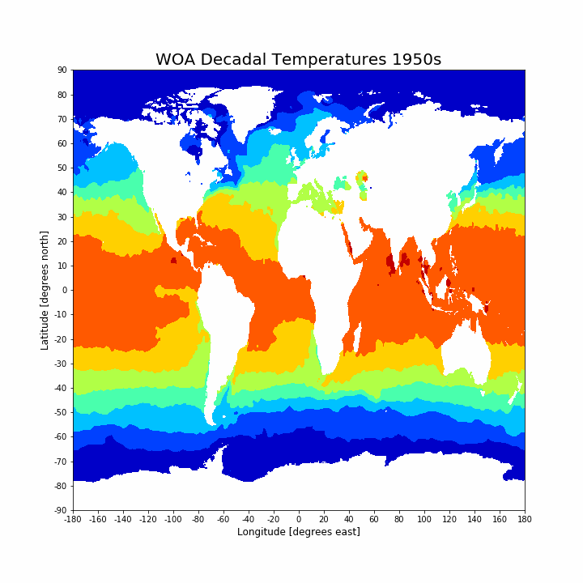

# Twilio Mini Workshop - Fun with Climate Data

### Ahoy, Twilio Developer Educators!

Today we will be learning a bit about oceanographic data science. Back in college I used to do [oceanographic research](https://agupubs.onlinelibrary.wiley.com/doi/abs/10.1029/2019GL084316), and I tought a couple of university courses on how to use Python to do analysis on oceanographic data and make cool images like this. Source: [World Ocean Atlas](https://www.nodc.noaa.gov/cgi-bin/OC5/woa18/woa18.pl?parameter=t). 

Today, we will be learning how to create a gif like you see below!

# Setup

All of our code will be written in Python (specifically, Python 3). To get setup correctly, please ensure you have Python installed on your machine. If it is not, you can install it from the official page [here](https://www.python.org/downloads/). Below, we will create a virtual environment and install the necessary Python packages to the virtual environment. We can then use either the command prompt (Windows) or terminal (Mac) to run the following commands in the local git repository.

1. Create the virtual environment.

`python3 -m venv venv`

2. Activate the virtual environment.

On Mac: `source venv/bin/activate`

On Windows: `venv\Scripts\activate.bat`

Your virtual environment should now be activated. You can tell when it is because the name (venv in this case) should appear in parenthesis at the beginning of each line in your terminal / command prompt as seen below.

### INSERT IMAGE

3. Make sure `pip` is up to date with the following command.

`pip install --upgrade pip`

4. Last, install all packages using `pip` to the virtual environment.

`pip install -r requirements.txt`

If this is not working well for you, please follow the following video tutorial to potentially address your challenges.

[Mac](https://www.youtube.com/watch?v=Kg1Yvry_Ydk&ab_channel=CoreySchafer)

[Windows](https://www.youtube.com/watch?v=APOPm01BVrk&ab_channel=CoreySchafer)